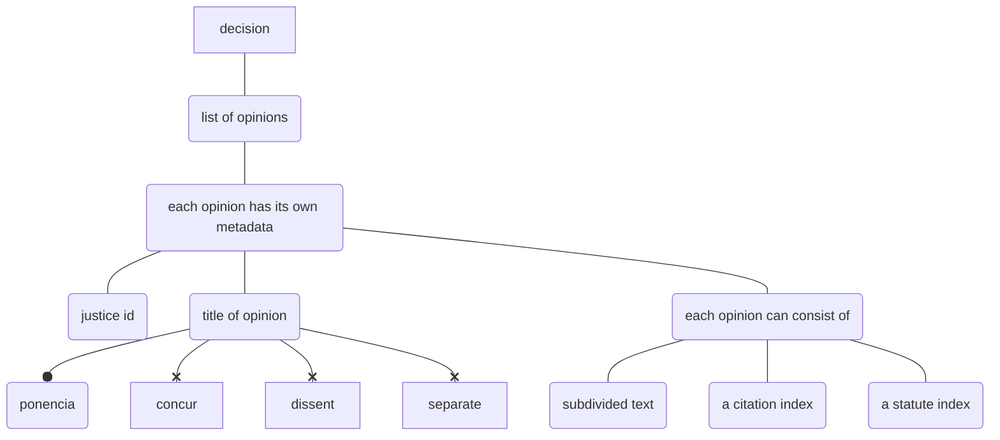

# Components

## Decision Opinions

Each decision is divided into opinions:

::: corpus_sc_toolkit.decisions.decision_opinions.DecisionOpinion

## Opinion Segments

Each decision is divided into opinions:

::: corpus_sc_toolkit.decisions.decision_opinion_segments.OpinionSegment
