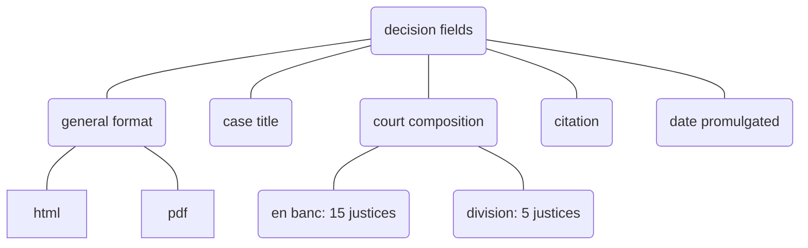

# Decision Fields



::: corpus_sc_toolkit.decisions.decision_fields.DecisionFields

## Source of Decisions

### PDF Files from the Supreme Court Official Website

A pre-existing sqlite database, found in `s3://corpus-pdf/db`, contains justices and decisions [extracted from pdf files](https://github.com/justmars/corpus-extractor). The database is replicated via the process below:

```py
>>> from dotenv import find_dotenv, load_dotenv
>>> from pylts import ConfigS3
>>> from pathlib import Path
>>> from sqlpyd import Connection
>>> load_dotenv(find_dotenv()) # ensure presence of env variables for litestream
>>> stream = ConfigS3(s3='s3://corpus-pdf/db', folder=Path().cwd() / "data")
>>> # stream.restore() # will download the database
>>> c = Connection(DatabasePath=str(stream.dbpath), WAL=True) # database access via `c.db`
```

Since the pdf files from the database have not yet been replicated to R2 storage, we need to initialize its contents into  an `DecisionPDF` where we can

```py
>>> from corpus_sc_toolkit import DecisionPDF
>>> interim_objs = DecisionPDF.originate(c.db) # raw data found in the database
>>> x = next(interim_objs) # x is an instance of an Interim Decision
>>> prefix_and_path = x.dump() # creates a temporary file with a conventional prefix
>>> prefix_and_path # display results
('GR/2021/10/227403/pdf.yaml',
 PosixPath('<path-to-library>/corpus_sc_toolkit/_tmp/temp.yaml'))
>>> x.put_in_storage(prefix_and_path) # uploads files, including opinions as txt files.
```

### HTML Files from the Supreme Court e-Library Website, other sources

The Supreme Court website contains decisions starting from 1996 onwards. Decisions dated prior to that year are only available through various secondary sources.

```py
>>> from corpus_sc_toolkit import DecisionHTML
>>> prefix = "GR/2021/10/227403/details.yaml" # assuming this exists
>>> obj = DecisionHTML.get(prefix)
>>> obj = type(obj) # x is an instance of a DecisionHTML
```

## Metadata

### Decision Source

::: corpus_sc_toolkit.decisions.fields.source.DecisionSource

### Decision Category

::: corpus_sc_toolkit.decisions.fields.category.DecisionCategory

### Court Composition

::: corpus_sc_toolkit.decisions.fields.composition.CourtComposition

### Title Tags

::: corpus_sc_toolkit.decisions.fields.tags.tags_from_title

### Vote Lines

#### Clean

::: corpus_sc_toolkit.decisions.fields.voteline.voteline_clean

#### Validate

::: corpus_sc_toolkit.decisions.fields.voteline.is_line_ok

#### Extract

::: corpus_sc_toolkit.decisions.fields.voteline.extract_votelines
