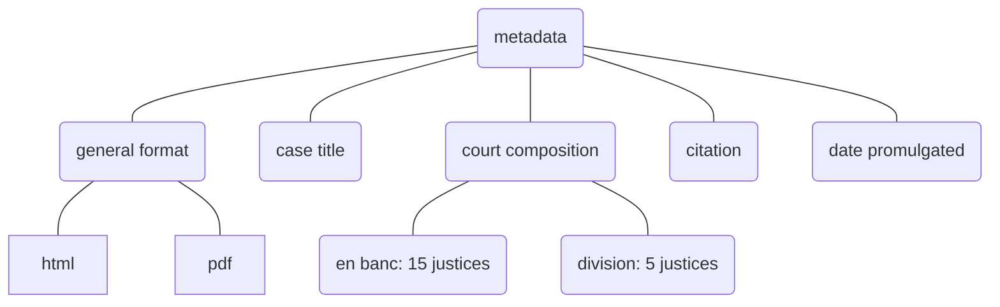
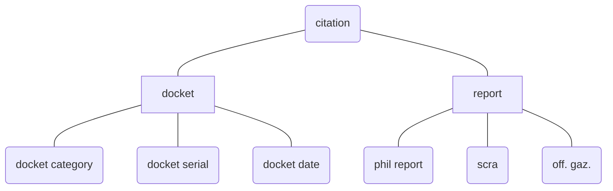
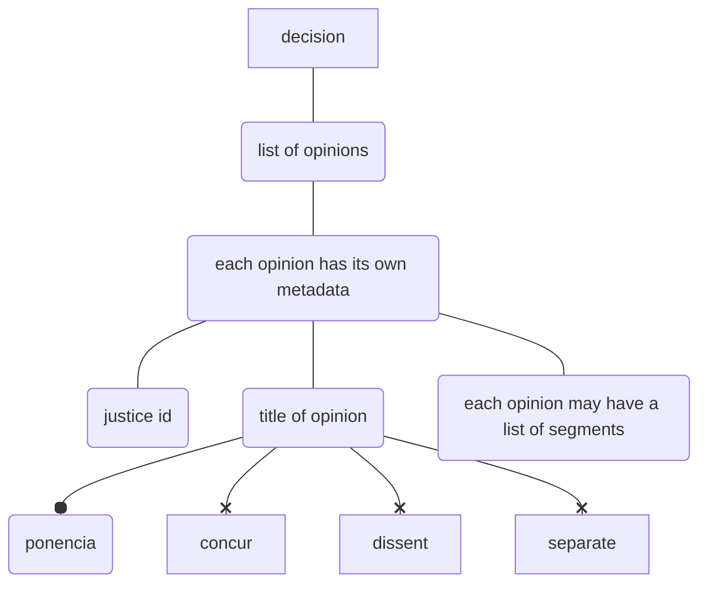

# corpus-sc-toolkit

Toolkit to process component elements of a Philippine Supreme Court decision.

## Metadata

## Citation

## Substructures

## Decision Fields

::: corpus_sc_toolkit.decisions._resources.DecisionFields

## Decision Opinions

Each decision is divided into opinions:

::: corpus_sc_toolkit.decisions._resources.DecisionOpinion

## Opinion Segments

Each decision is divided into opinions:

::: corpus_sc_toolkit.decisions._resources.OpinionSegment
